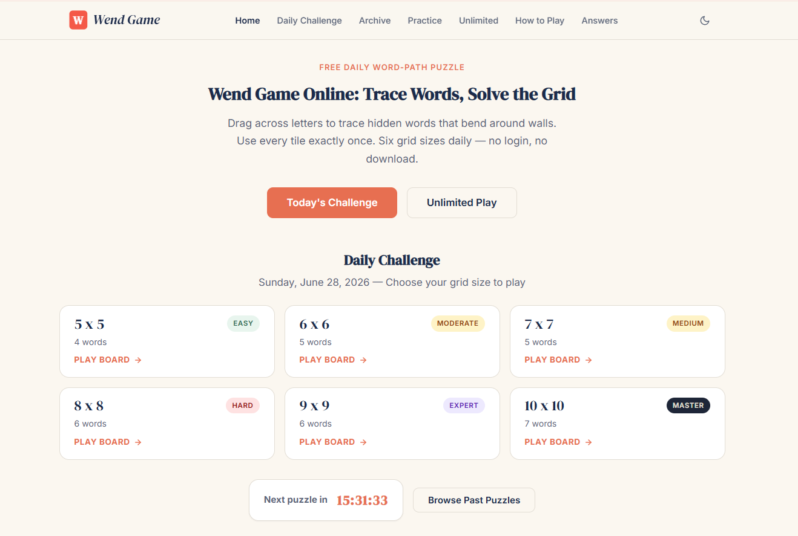
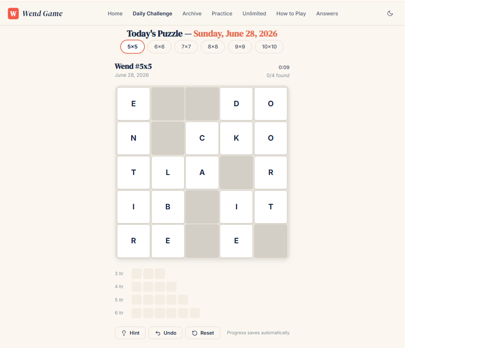
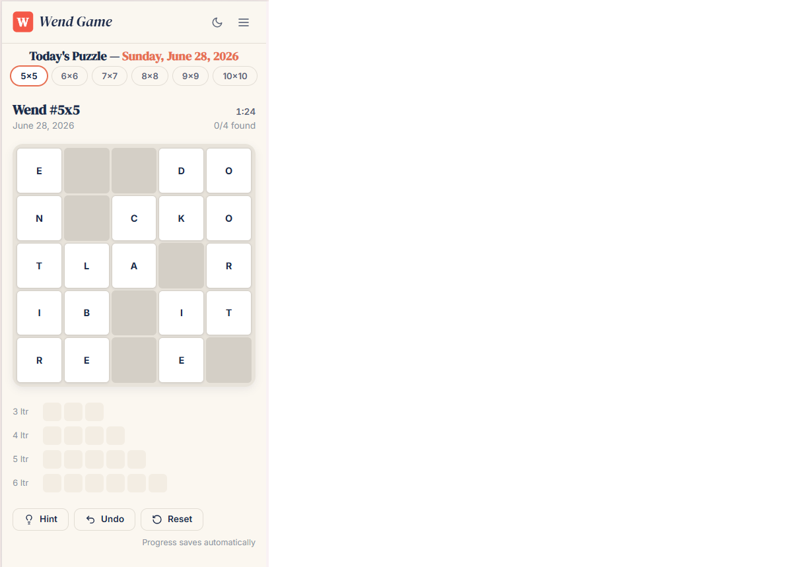

# 🎮 Wend Game – Play the Daily Wend Puzzle Online for Free

<p align="center">
  <a href="https://wendplay.com">
    
  </a>
</p>

<h1 align="center">Wend Game</h1>

<p align="center">
A fast, modern and free <strong>Daily Wend Puzzle Game</strong> built with - Next.js, React Node.js HTML, CSS and JavaScript.
</p>

<p align="center">
Play a new puzzle every day • No Downloads • No Registration • Mobile Friendly
</p>

<p align="center">

<a href="https://wendplay.com">

</a>

<a href="https://github.com/RealTabbukhan/Wend-Game/stargazers">

</a>

<a href="https://github.com/RealTabbukhan/Wend-Game/network/members">

</a>

<a href="https://github.com/RealTabbukhan/Wend-Game/issues">

</a>

<a href="https://github.com/RealTabbukhan/Wend-Game/commits/main">

</a>

<a href="https://github.com/RealTabbukhan/Wend-Game/blob/main/LICENSE">

</a>


</p>

---

# 🚀 Play Online

## 🌐 https://wendplay.com/

Play the latest **Daily Wend Puzzle** directly in your browser.

No installation.

No signup.

Completely free.

---

# 📖 About

**Wend Game** is a modern browser-based daily word puzzle inspired by the popular Wend challenge.

The project is designed to deliver a fast, responsive and enjoyable experience on desktop, tablet and mobile devices.

Every day a new puzzle is available for players around the world.

Whether you're a casual player or a word game enthusiast, Wend Game offers a clean interface, smooth gameplay and challenging puzzles that keep your mind active.

---

# ✨ Features

* 🎯 Daily Wend Puzzle
* 🎮 Unlimited Practice Mode
* ⚡ Lightning Fast Gameplay
* 📱 Fully Responsive Design
* 💻 Desktop & Mobile Support
* 🌙 Beautiful Modern UI
* 📊 Game Statistics
* 🏆 Daily Challenges
* 🔥 SEO Optimized
* 🚀 High Performance
* 🌍 Cross Browser Compatible
* ♿ Accessibility Friendly
* 🎨 Smooth Animations
* 📦 Lightweight Codebase
* 💯 Free Forever

---

# 🎯 Why Choose Wend Game?

Unlike many browser games, Wend Game focuses on simplicity, speed and user experience.

✔ Daily fresh puzzles

✔ 5 Grid Sizes (5*5 to 10*10)

✔ See Past Wend Game Anwers

✔ Instant gameplay

✔ Fast loading

✔ Responsive design

✔ Clean interface

✔ Works on every device

✔ No downloads

✔ No registration

✔ Completely free

---

# 🎮 How to Play

1. Visit https://wendplay.com/
2. Open today's puzzle.
3. Guess the hidden word.
4. Use the hints provided after each guess.
5. Solve the puzzle in the fewest attempts.
6. Return tomorrow for a brand-new challenge.

---

# 📸 Screenshots

## Home Page

<p align="center">

</p>

---

## Gameplay

<p align="center">

</p>

---

## Mobile

<p align="center">

</p>

---

# 🛠️ Built With

- Next.js
- React
- Node.js
- TypeScript
- Tailwind CSS
- HTML5
- CSS3
- JavaScript (ES6+)
- Responsive Web Design
- Progressive Web App (PWA)

---

# 🌐 Browser Support

| Browser         | Supported |
| --------------- | --------- |
| Chrome          | ✅         |
| Firefox         | ✅         |
| Edge            | ✅         |
| Safari          | ✅         |
| Opera           | ✅         |
| Brave           | ✅         |
| Mobile Browsers | ✅         |

---

# 🚀 Performance

* ⚡ Fast Loading
* 🚀 Optimized JavaScript
* 📱 Mobile Optimized
* ♿ Accessibility Ready
* 🔍 SEO Friendly
* 📦 Lightweight Assets

---

# 🤝 Contributing

Contributions are always welcome!

You can contribute by:

* ⭐ Starring this repository
* 🍴 Forking the project
* 🐛 Reporting bugs
* 💡 Suggesting new features
* 🔧 Improving the code
* 🌍 Adding new languages
* 📖 Improving documentation

Simply fork the repository, create your feature branch, commit your changes and submit a Pull Request.

---

# 🗺️ Roadmap

* [ ] More daily puzzles
* [ ] Multiplayer mode
* [ ] Global Leaderboard
* [ ] Achievements
* [ ] Themes
* [ ] Dark Mode
* [ ] Statistics Dashboard
* [ ] Offline Support
* [ ] Progressive Web App
* [ ] More Languages

---

# ⭐ Show Your Support

If you like this project,

⭐ Star the repository

🍴 Fork it

📢 Share it

❤️ Contribute

Your support helps the project continue to grow.

---

# 🌍 Live Website

## https://wendplay.com/

Play today's puzzle now!

---

# 🔍 SEO Keywords

Daily Wend Puzzle

Wend Game

Play Wend Game

Wend Play

Wend Game Online

Wend Game Unlimited

Daily Word Game

Wend Game Free

Browser Word Game

Word Puzzle Game

JavaScript Game

Online Puzzle Game

Daily Brain Game

Logic Puzzle

Free Puzzle Game

Vocabulary Game

Word Guess Game

Responsive Browser Game

Daily Challenge Game

---

# 📜 License

This project is licensed under the **WendPlay Attribution License 1.0**.

### Attribution Required

If you use, modify, or redistribute this project, you **must** provide visible credit to:

👉 **https://wendplay.com/**

For websites, the credit must include a clickable link such as:

```html
Powered by <a href="https://wendplay.com/">WendPlay</a>
```

See the `LICENSE` file for the complete terms.

---

<h2 align="center">🎉 Ready for Today's Challenge?</h2>

<p align="center">

<a href="https://wendplay.com">

</a>

</p>

<p align="center">

<strong>🌐 https://wendplay.com/</strong>

<br><br>

⭐ If you enjoyed this project, please consider giving it a Star!

</p>
